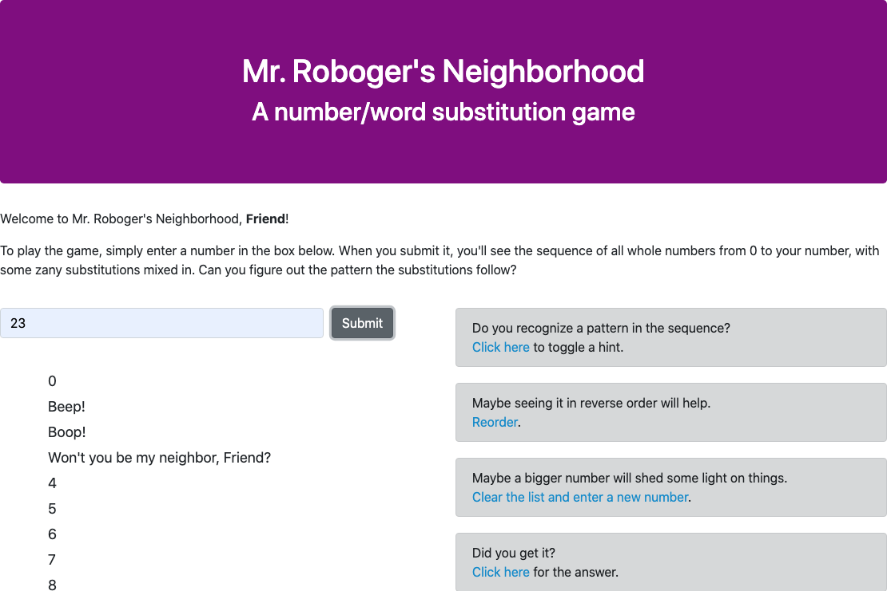

# Mr. Roboger's Neighborhood

### A number/word substitution game.

### _By Micah Olson_

## Technologies Used
* HTML5
* CSS (extended by Bootstrap 4.5.3)
* JavaScript (extended by jQuery 3.5.1)

## Description
Submit a number to receive a sequence of whole numbers, from 0 to your number, with some fun word substitutions. Can you guess the pattern?  

 

## Setup and Installation
* This project's interactive web page can be viewed [here](https://micaholson.github.io/mr-robogers-neighborhood).  

* To download, then view or edit a local copy yourself, follow the instructions below:  

  * Clone the repository to a local directory using the command-line tool `git` ([how to install git](https://www.learnhowtoprogram.com/introduction-to-programming/getting-started-with-intro-to-programming/git-and-github)).  
    `$ cd ~/[directory]/[path]/[of]/[choice]/`  
    `$ git clone https://github.com/MicahOlson/mr-robogers-neighborhood.git`  
  
  * Navigate to the top level of the project directory.  
    `$ cd mr-robogers-neighborhood/`   

  * To view the site locally, open the file called `index.html` in your default browser.  
    `$ open index.html`  

    * Alternatively, you can navigate to the project directory through your system's GUI file manager, then double-click `index.html` to open it in your default browser.  

  * To edit the project, open the files in your preferred code editor. Here are some recommendations:
    * [Visual Studio Code](https://code.visualstudio.com) - "Code editing. Redefined."
    * [Atom](https://atom.io) - "A hackable text editor for the 21st Century"
    * [SublimeText](https://www.sublimetext.com) - "A sophisticated text editor for code, markup and prose" 

## Tests
  ```
  Describe: beepBoop()

  Test: "It should return an array with a 0 if the number 0 is inputted"
  Expect(beepBoop(0).toEqual([0]);

  Test: "It should return an array with a sequence of elements from 0 to the number inputted"
  Expect(beepBoop(5).toEqual([0, 1, 2, 3, 4, 5]);

  Test: "It should recognize if a number in the sequence includes a 1 and replace it with 'Beep!'"
  Expect(beepBoop(10).toEqual([0, "Beep!", 2, 3, 4, 5, 6, 7, 8, 9, "Beep!"]);

  Test: "It should recognize if a number in the sequence includes a 2, taking precedence over numbers with a 1, and replace it with 'Boop!'"
  Expect(beepBoop(12).toEqual([0, "Beep!", "Boop!", 3, 4, 5, 6, 7, 8, 9, "Beep!", "Beep!", "Boop!"]);

  Test: "It should recognize if a number in the sequence includes a 3, taking precedence over numbers with a 1 or 2, and replace it with 'Won't you be my neighbor?'"
  Expect(beepBoop(13).toEqual([0, "Beep!", "Boop!", "Won't you be my neighbor?", 4, 5, 6, 7, 8, 9, "Beep!", "Beep!", "Boop!", "Won't you be my neighbor?"]);
  ```

## Known Bugs
* The program will fail to generate the game's number sequence if a non-numeric value is inputted
* Please let me know of any bugs you find at the email address below 

## License
[GPLv3](https://choosealicense.com/licenses/gpl-3.0/)\
Copyright &copy; 2021 Micah L. Olson

## Contact Information
Micah Olson micah.olson@protonmail.com